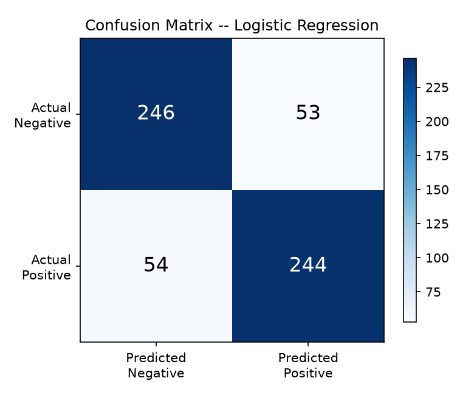

# Customer Review Sentiment Analysis

A classical machine-learning project that reads a customer review and predicts whether it is **Positive** or **Negative**.

Built with **TF-IDF + Logistic Regression** (scikit-learn), with a **Streamlit** web interface. No deep learning — the point of this project is to show a solid grip on traditional ML and NLP fundamentals end to end.

**Measured test-set accuracy: 82.1%** on 597 unseen real reviews. Every number in this README was produced by running the code; nothing is estimated. See [Actual evaluation results](#11-actual-evaluation-results).

---

## Table of contents

1. [Project overview](#1-project-overview)
2. [Problem statement](#2-problem-statement)
3. [Dataset](#3-dataset)
4. [Technologies](#4-technologies)
5. [The ML pipeline](#5-the-ml-pipeline)
6. [Folder structure](#6-folder-structure)
7. [Installation](#7-installation)
8. [Training](#8-training)
   - [The notebook](#8b-the-notebook)
9. [Evaluation](#9-evaluation)
10. [Running the Streamlit app](#10-running-the-streamlit-app)
11. [Actual evaluation results](#11-actual-evaluation-results)
12. [Example predictions](#12-example-predictions)
13. [Tests](#13-tests)
14. [Limitations](#14-limitations)
15. [Future improvements](#15-future-improvements)

---

## 1. Project overview

Businesses receive more written feedback than any human can read. This project automates the first pass: it takes review text and sorts it into positive or negative, with a confidence score, so that negative feedback can be surfaced quickly.

The project covers the whole workflow:

```
Dataset -> Data exploration -> Text preprocessing -> Train/test split
        -> Feature extraction (TF-IDF) -> Model training -> Evaluation
        -> Saved model -> Prediction -> Web interface
```

Two things this project does that are worth pointing out:

- **Every parameter choice was measured, not guessed.** `min_df=1` and `C=10` are unusual defaults; both were chosen by cross-validating on the training set only, and the grids are recorded in the code comments and in [SYSTEM_GUIDE.md](SYSTEM_GUIDE.md).
- **It explains its predictions.** Because Logistic Regression has one weight per word, the app shows exactly which words pushed a review positive or negative.

Companion documents:

- **[SYSTEM_GUIDE.md](SYSTEM_GUIDE.md)** — every concept in this project explained in simple English, from "what is NLP" to "what is data leakage".
- **[VIVA_QUESTIONS.md](VIVA_QUESTIONS.md)** — 45 interview questions with short answers, plus a 60-second and a 2-minute spoken explanation of the project.

---

## 2. Problem statement

> Given the text of a customer review, automatically classify its sentiment as **Positive** or **Negative**, and report how confident the model is.

This is a **binary text classification** problem — supervised learning, because every review in the training data comes with a human-assigned label.

**Why it matters:** a company with thousands of reviews per week cannot read them all. Automatic sentiment tagging lets it (a) monitor whether satisfaction is trending up or down, (b) route angry reviews to support first, and (c) find out *which* words unhappy customers keep using.

**What is explicitly out of scope:** neutral sentiment, star-rating prediction, non-English text, topic/aspect extraction, and sarcasm detection. See [Limitations](#14-limitations).

---

## 3. Dataset

**Sentiment Labelled Sentences** from the UCI Machine Learning Repository — real, human-labelled review sentences.

| | |
| --- | --- |
| Source | [UCI ML Repository, dataset 331](https://archive.ics.uci.edu/dataset/331/sentiment+labelled+sentences) |
| Citation | Kotzias, Denil, de Freitas, Smyth — *"From Group to Individual Labels using Deep Features"*, KDD 2015 |
| Size on disk | ~82 KB |
| Rows as downloaded | 3,000 |
| Rows after cleaning | **2,982** (18 removed: duplicates and rows left empty by cleaning) |
| Class balance | 1,492 negative / 1,490 positive — essentially perfectly balanced |
| Labels | `1` = positive, `0` = negative. **No neutral class.** |
| Average length | 12.2 words (shortest 1 word, longest 74) |

Where the reviews come from, after cleaning:

| Source | Rows | Domain |
| --- | --- | --- |
| imdb.com | 996 | movie reviews |
| yelp.com | 996 | restaurant reviews |
| amazon.com | 990 | product reviews (phone accessories) |

The dataset is **not committed to this repository** — you rebuild it with one command (see [Installation](#7-installation)). Full details, manual download steps, and a note on the hand-written demo file are in **[data/README.md](data/README.md)**.

> **On honesty about data:** `data/sample_reviews.csv` contains 20 sentences I wrote by hand to test the CSV-upload feature. It is clearly labelled as demo data and is never used to measure performance.

---

## 4. Technologies

| Tool | Version used | What it does here |
| --- | --- | --- |
| Python | 3.14.4 | language |
| pandas | 3.0.5 | loading the CSV, cleaning, deduplication |
| NumPy | 2.5.3 | numeric arrays (underneath scikit-learn) |
| scikit-learn | 1.9.1 | TF-IDF, Logistic Regression, Naive Bayes, metrics, splitting |
| joblib | 1.6.0 | saving/loading the trained model and vectorizer |
| matplotlib | 3.11.2 | confusion-matrix image |
| Streamlit | 1.63.0 | the web interface |
| pytest | 9.1.1 | the test suite |
| python-dotenv | 1.2.3 | optional `.env` support (not required) |

`requirements.txt` uses `>=` lower bounds so it installs on older Python too; the exact versions above are the ones that produced the results in this README.

---

## 5. The ML pipeline

### Step 1 — Load and inspect (`src/preprocessing.py`)

Read the CSV, check the expected columns exist, and print class balance, review lengths, and rows per source. Looking at the data before modelling is what tells you the dataset is balanced — which in turn tells you accuracy is a *reasonable* headline metric here.

### Step 2 — Clean the data

1. Normalise labels to `0`/`1`. Anything unrecognised (e.g. `neutral`) is **dropped, not guessed**.
2. Drop rows with missing or blank review text.
3. **Drop duplicate reviews.** This matters more than it looks: if the same sentence lands in both the train and test halves, the test score is inflated because the model has already seen the answer.
4. Clean the text, then drop anything that came out empty.

### Step 3 — Text preprocessing (`clean_text`)

Deliberately **light**. Each step below is safe; each step we left out was left out on purpose.

| Step | Why |
| --- | --- |
| Lowercase | `"Good"` and `"good"` should be one feature, not two |
| Remove URLs | a web address carries no sentiment |
| Remove HTML tags | review dumps often contain `<br />` |
| Drop punctuation/symbols | scikit-learn's tokenizer discards them anyway |
| Collapse whitespace | `"too    many spaces"` → `"too many spaces"` |

**What we do NOT do, and why:**

- **No stopword removal.** The single most important reason: `"not good"` minus the stopword `"not"` becomes `"good"` — the exact opposite meaning. A stopword remover is provided in `preprocessing.py` as an opt-in helper, with negation words (`not`, `no`, `never`, `but`, `very`, `too`) deliberately left out of the list.
- **No stemming or lemmatisation.** These merge `"worst"` → `"worse"`-type variants, which saves a few features but costs nuance, and adds an NLTK/spaCy dependency for no measured gain on 12-word sentences.
- **No contraction expansion.** We tried it (`"don't"` → `"do not"`). Cross-validation moved by less than one standard deviation, so it was dropped to keep the code simpler. *Measured, not assumed.*
- **Digits are kept.** `"2 stars"` and `"10/10"` carry real signal.

### Step 4 — Train/test split

80% train / 20% test, **stratified** on the label, `random_state=42`.

- **Stratified** means both halves keep the same positive/negative ratio, so the test set is a fair miniature of the whole dataset.
- **`random_state=42`** makes the split identical on every run, so the numbers in this README are reproducible.
- Result: **2,385 training** reviews, **597 test** reviews.

### Step 5 — Feature extraction with TF-IDF (`src/features.py`)

Logistic Regression multiplies numbers by weights; it cannot multiply the word `"terrible"`. So each review becomes a vector of numbers.

**TF-IDF = Term Frequency × Inverse Document Frequency.**

- **TF** — how often a word appears in *this* review. Used a lot here ⇒ probably important here.
- **IDF** — how rare the word is across *all* reviews. `"the"` is everywhere ⇒ tiny weight. `"refund"` is rare ⇒ big weight.
- A word scores high only when it is **frequent here and rare overall** — which is exactly what makes it informative.

Configuration, and the evidence for each choice (all cross-validated on the **training set only**):

| Parameter | Value | Why |
| --- | --- | --- |
| `ngram_range` | `(1, 2)` | Unigrams + bigrams. This is how a bag-of-words model can see negation: `"not"` and `"good"` separately look positive-ish, but `"not good"` becomes its own feature. **It works — the model learned `not good` with a weight of −3.45.** Measured: `(1,2)` beat `(1,1)` by 0.2–0.4 points. |
| `min_df` | `1` | Keep even words seen once. Unusual, so it needs justifying: with only 2,385 short training sentences, plenty of real sentiment words (`"refund"`, `"flawless"`) appear exactly once. Measured CV accuracy: `min_df=1` → 0.839, `2` → 0.829, `3` → 0.819. On a much larger corpus `min_df=2` usually *does* help. |
| `max_features` | `20000` | The full vocabulary is 21,269, so this cap only trims the ~1,300 rarest terms and changed CV accuracy by nothing to 4 decimal places. Kept as a cheap safety rail for bigger datasets. |
| `strip_accents` | `"unicode"` | `"cafe"` and `"café"` collapse into one feature |
| `lowercase` | `False` | `clean_text()` already did it — doing it twice wastes time |
| `sublinear_tf` | *not used* | It dampens repeated words, but these are single sentences where almost nothing repeats. Measured: −0.2 points. Dropped rather than carrying a parameter that does nothing. |

**The result is a sparse matrix**: 2,385 rows × 20,000 columns, of which only **48,425 cells are non-zero — 0.10%**. Counting unigrams and bigrams, the average review touches just 20 of the 20,000 columns. SciPy stores only the non-zero values, which is what makes this feasible at all; the dense version would be 47 million numbers.

**This is also where data leakage is avoided.** The vectorizer is `fit` on the **training text only** and merely `transform`s the test text. Calling `fit_transform` on the whole dataset would let the IDF weights and vocabulary be computed using test reviews, and the test score would come out too optimistic. Split → fit on train → transform test.

### Step 6 — Model training (`src/train.py`)

| Model | Role | Key settings |
| --- | --- | --- |
| **Logistic Regression** | **primary / deployed** | `solver="liblinear"`, `C=10.0`, `max_iter=1000` |
| Multinomial Naive Bayes | baseline for comparison | `alpha=1.0` |

`C` is the inverse of the regularisation strength — small `C` forces weights towards zero, large `C` lets them grow. It was chosen by 5-fold cross-validation on the **training set only**:

| C | 1 | 2 | 5 | **10** | 20 | 50 | 100 |
| --- | --- | --- | --- | --- | --- | --- | --- |
| CV accuracy | 0.810 | 0.821 | 0.831 | **0.839** | 0.842 | 0.839 | 0.840 |

The curve flattens from `C=10` onwards, and everything above sits inside one standard deviation (±0.006). So we take the **smallest `C` on the plateau**: the same score with more regularisation and a simpler model.

Both models are also 5-fold cross-validated on the training set before the test set is touched once.

### Step 7 — Evaluation (`src/evaluate.py`)

Accuracy, precision, recall, F1 (per class and macro), ROC-AUC, and a confusion matrix saved as a PNG. See [Actual evaluation results](#11-actual-evaluation-results).

### Step 8 — Save the model

`joblib.dump()` writes two files to `models/`:

- `sentiment_model.joblib` — the fitted Logistic Regression
- `tfidf_vectorizer.joblib` — the fitted vectorizer

**Both are required.** A model whose weight #4231 means `"not good"` is useless without the vectorizer that decides column 4231 *is* `"not good"`. The Streamlit app loads these and **never retrains**.

---

## 6. Folder structure

```
Customer Review Sentiment Analysis/
│
├── data/
│   ├── README.md              # where the dataset comes from + how to get it
│   ├── reviews.csv            # the real dataset (downloaded, not in git)
│   └── sample_reviews.csv     # 20 hand-written DEMO sentences (in git)
│
├── notebooks/
│   └── sentiment_analysis.ipynb   # exploration + the tuning experiments
│
├── src/
│   ├── config.py              # all paths and settings in one place
│   ├── download_data.py       # fetches the dataset -> data/reviews.csv
│   ├── preprocessing.py       # clean_text() + load_dataset()
│   ├── features.py            # TF-IDF vectorizer + weight inspection
│   ├── train.py               # the full training run
│   ├── evaluate.py            # metrics + confusion-matrix plot
│   └── predict.py             # load model, predict, explain
│
├── models/                    # saved .joblib artifacts (not in git)
├── reports/
│   ├── metrics.json           # every measured number from the last run
│   └── confusion_matrix.png
│
├── tests/                     # 86 pytest tests
│   ├── test_preprocessing.py
│   ├── test_features.py
│   ├── test_evaluate.py
│   └── test_predict.py
│
├── app.py                     # the Streamlit interface
├── requirements.txt
├── README.md                  # this file
├── SYSTEM_GUIDE.md            # study guide: every concept explained
├── VIVA_QUESTIONS.md          # 45 Q&A + spoken explanations
├── .gitignore
└── .env.example
```

---

## 7. Installation

**Requires Python 3.9 or newer.** Run everything from the project root.

```bash
# 1. Create and activate a virtual environment
python -m venv .venv

# Windows (PowerShell)
.venv\Scripts\Activate.ps1
# Windows (CMD)
.venv\Scripts\activate.bat
# macOS / Linux
source .venv/bin/activate

# 2. Install dependencies
pip install -r requirements.txt

# 3. Download the dataset (~82 KB)
python -m src.download_data
```

No API keys and no secrets are needed — everything runs locally. `.env.example` exists only to document a few optional path overrides; you can ignore it.

*(If the machine has no internet, see [data/README.md](data/README.md) for the manual download route.)*

---

## 8. Training

```bash
python -m src.train
```

Takes a few seconds. It prints each stage, then writes `models/*.joblib`, `reports/metrics.json` and `reports/confusion_matrix.png`.

Abridged real output:

```
[1/7] Loading data
Loaded 3000 rows from reviews.csv
Usable rows after cleaning: 2982 (removed 18)
  Negative: 1492 (50.0%)
  Positive: 1490 (50.0%)

[2/7] Splitting 80% train / 20% test (stratified)
  train: 2385 reviews
  test : 597 reviews

[3/7] Fitting TF-IDF on the training text only
  vocabulary size : 20000 terms
  train matrix    : 2385 x 20000
  non-zero cells  : 48425 (0.10% of the matrix)

[4/7] Training models and running 5-fold cross-validation on the training set

  Logistic Regression
    CV accuracy    : 0.8377 (+/- 0.0119)
    train accuracy : 1.0000
    test accuracy  : 0.8208
    test F1 (macro): 0.8208

  Multinomial Naive Bayes
    CV accuracy    : 0.8344 (+/- 0.0078)
    train accuracy : 0.9941
    test accuracy  : 0.8107
    test F1 (macro): 0.8107
```

To train on your own CSV (needs a `review` column and a `label` column):

```bash
python -m src.train --data path/to/my_reviews.csv
```

---

## 8b. The notebook

`notebooks/sentiment_analysis.ipynb` is the lab notebook behind the decisions in
`src/`. **It is committed with its outputs already executed**, so you can read it
straight on GitHub without installing anything.

It contains:

1. Data exploration — class balance, review lengths, most common words per class
2. What `clean_text()` actually does, including a demo of how a *typical* stopword
   list would flip `"not good"` into something positive
3. The split, and why it comes before the vectorizer
4. TF-IDF inspected term by term: the highest and lowest IDF values, and real
   TF-IDF numbers for one sentence
5. **The four tuning experiments** (`C`, `min_df`, `ngram_range`, `sublinear_tf`) —
   all on cross-validation, training set only
6. Training and evaluating both models
7. Reading the learned weights, including a table proving the bigrams worked
   (`good` +8.14 vs `not good` −3.45) and the suspicious `and` weight
8. **Error analysis** — reading the reviews the model got wrong, and checking
   whether its mistakes were confident or borderline

To re-run it yourself:

```bash
pip install jupyter
jupyter notebook notebooks/sentiment_analysis.ipynb
```

It reproduces the same 0.8208 test accuracy as `python -m src.train`, which is a
useful check that the notebook and the scripts really are doing the same thing.

---

## 9. Evaluation

Re-score the **saved** model on the same held-out test set without retraining:

```bash
python -m src.evaluate
```

This works because the split uses a fixed `random_state`, so the same 20% of rows is rebuilt exactly. It reproduces 82.08% — a useful check that the saved artifacts really are the model that was measured.

---

## 10. Running the Streamlit app

```bash
streamlit run app.py
```

Then open <http://localhost:8501>.

**Tab 1 — Single review**
1. Pick an example from the dropdown or type your own review.
2. Click **Analyze Sentiment**.
3. You get: the predicted sentiment, a confidence percentage, both class probabilities, a plain-English note on what the model did, and a table of **which words drove the prediction** (each word's TF-IDF value × its learned weight — the actual arithmetic behind the answer).

**Tab 2 — Batch CSV**
Upload a CSV, choose the text column, and every row is scored. You get counts, a results table, and a CSV download. If your file also has a `label` column, the app reports the real accuracy on those rows. Try it with `data/sample_reviews.csv`.

The sidebar shows the model's measured test-set scores, **read from `reports/metrics.json`** rather than typed into the app — so it can never display a number the model did not actually achieve.

The app loads the saved `.joblib` files and never retrains. If you run it before training, it says so and tells you which commands to run.

---

## 11. Actual evaluation results

All figures below come from `python -m src.train` on 2026-09-11 and are stored in [`reports/metrics.json`](reports/metrics.json). The test set is **597 real reviews the models never saw during training or tuning**.

### Model comparison

| | CV accuracy (train set) | Train accuracy | **Test accuracy** | Test F1 (macro) | Test ROC-AUC |
| --- | --- | --- | --- | --- | --- |
| **Logistic Regression** (deployed) | 0.8377 ± 0.0119 | 1.0000 | **0.8208** | **0.8208** | **0.8952** |
| Multinomial Naive Bayes | 0.8344 ± 0.0078 | 0.9941 | 0.8107 | 0.8107 | 0.8939 |

Logistic Regression wins on the test set by **1.0 percentage point**. That margin is small — comparable to the cross-validation spread — so the honest summary is "Logistic Regression is slightly ahead and more interpretable", not "Logistic Regression is clearly better".

### Logistic Regression — detailed report

```
              precision    recall  f1-score   support

    Negative     0.8200    0.8227    0.8214       299
    Positive     0.8215    0.8188    0.8202       298

    accuracy                         0.8208       597
   macro avg     0.8208    0.8208    0.8208       597
weighted avg     0.8208    0.8208    0.8208       597
```

| Metric | Value | In plain English |
| --- | --- | --- |
| Accuracy | **82.08%** | 490 of 597 test reviews were classified correctly |
| Precision (positive) | 0.8215 | of the reviews we *called* positive, 82% really were |
| Recall (positive) | 0.8188 | of the reviews that *were* positive, we found 82% |
| F1 (positive) | 0.8202 | the balance between those two |
| F1 (macro) | 0.8208 | both classes averaged equally |
| ROC-AUC | 0.8952 | ranking quality, independent of the 0.5 threshold |

Precision and recall are nearly identical for both classes — the model is not biased towards either sentiment, which is what you would hope for on a balanced dataset.

### Confusion matrix



|  | Predicted Negative | Predicted Positive |
| --- | --- | --- |
| **Actual Negative** | 246 ✅ | 53 ❌ (false positive) |
| **Actual Positive** | 54 ❌ (false negative) | 244 ✅ |

The 107 errors are split almost evenly (53 vs 54), so the model is not systematically over-cheerful or over-harsh.

### Why accuracy alone is not enough

Our dataset happens to be balanced, so accuracy here is meaningful. It often is not. If 95% of reviews were positive, a model that blindly answers "Positive" every time would score **95% accuracy** while never catching a single unhappy customer — its recall on the negative class would be **0**. Precision, recall, F1 and the confusion matrix expose that; accuracy hides it. (`tests/test_evaluate.py` contains this exact scenario as a test.)

### Overfitting: the honest read

Train accuracy is **1.0000** and test accuracy is **0.8208** — an 18-point gap. The model has memorised its training data perfectly.

This is expected and, here, accepted:

- With 20,000 features and 2,385 examples, a linear model can almost always separate the training set exactly. Text classification nearly always looks like this.
- What matters is that the **honest estimates agree with each other**: cross-validation said 0.8377 and the untouched test set said 0.8208. If the test score had collapsed to, say, 0.60, the gap would be a real problem.
- `C` and `min_df` were chosen by cross-validation precisely to control this. More regularisation (`C=1`) *lowers* the gap but also lowers real accuracy to 0.810 — so it makes the model worse, not better.

### What the model learned

The 10 strongest weights per class. These read like genuine sentiment words, which is a good sanity check that the model learned the task rather than some artefact of the data:

| Positive | Weight | Negative | Weight |
| --- | --- | --- | --- |
| great | +10.49 | not | −9.33 |
| good | +8.14 | bad | −7.43 |
| love | +5.12 | poor | −5.14 |
| nice | +5.11 | terrible | −4.78 |
| amazing | +4.98 | worst | −4.69 |
| excellent | +4.83 | don | −4.26 |
| and | +4.53 | disappointment | −3.59 |
| delicious | +4.28 | stupid | −3.48 |
| wonderful | +4.24 | **not good** | **−3.45** |
| well | +4.17 | awful | −3.40 |

Three things to notice:

- **`not good` is a bigram**, and it earned a strong negative weight. This is the `ngram_range=(1, 2)` decision paying off exactly as intended.
- **`don`** is the leftover of `"don't"` after punctuation is stripped, so it acts as a proxy for `"don't"` — negative, as you would expect.
- **`and` at +4.53 is a red flag worth owning.** `"and"` has no sentiment. It scores highly because in this dataset positive sentences happen to string clauses together (`"good value and fast delivery"`). That is the model latching onto a quirk of a small corpus, not learning language — precisely the kind of thing more data would fix.

---

## 12. Example predictions

Real output from `python -m src.predict "..."`:

```
$ python -m src.predict "Fantastic quality and the delivery was really fast."
Review    : Fantastic quality and the delivery was really fast.
Sentiment : Positive
Confidence: 93.9%
P(positive)=0.939  P(negative)=0.061
Top drivers:
  fantastic            +0.9381  (positive)
  and                  +0.4256  (positive)
  delivery             +0.3398  (positive)
  delivery was         +0.3398  (positive)
```

```
$ python -m src.predict "The battery died after two days and support ignored me."
Review    : The battery died after two days and support ignored me.
Sentiment : Negative
Confidence: 93.7%
P(positive)=0.063  P(negative)=0.937
Top drivers:
  the battery          -0.6736  (negative)
  and                  +0.4380  (positive)
  support              -0.3567  (negative)
  after                -0.3538  (negative)
```

There is also an interactive mode — run `python -m src.predict` with no arguments.

**On the demo CSV:** running `data/sample_reviews.csv` through the batch predictor gives 19/20 correct. That file is my own hand-written, deliberately clear-cut demo data, so **that 95% is not a performance claim** — the honest number is the 82.1% measured on the real held-out test set.

---

## 13. Tests

```bash
pytest -v
```

**Result: 86 passed.**

| File | Covers |
| --- | --- |
| `test_preprocessing.py` | cleaning (case, URLs, HTML, punctuation, digits, non-string input, idempotence), label normalisation, dataset loading (duplicates, missing values, bad labels, helpful errors) |
| `test_features.py` | TF-IDF configuration, bigram creation, sparsity, L2 normalisation, that rare words get higher IDF than common ones, that unseen words are ignored rather than added, that transforming before fitting raises |
| `test_evaluate.py` | metrics checked against a hand-worked 10-row example, the always-predict-one-class trap, JSON-safety, PNG output |
| `test_predict.py` | model loading, that the model's weight count matches the vectorizer's vocabulary, `joblib` round-trip, determinism, batch/single agreement, row order preserved when blank rows are mixed in, empty and out-of-vocabulary input handling |

The prediction tests skip themselves with a clear message if `models/` is empty, so a fresh clone gives a useful result rather than a confusing failure.

---

## 14. Limitations

Honest list of what this model cannot do.

1. **No neutral class.** The training data has only positive and negative, so `"It arrived on Tuesday"` is forced into one of the two. This is the single biggest practical limitation.
2. **Sarcasm and irony fail.** `"Great, it broke on day one"` contains the strongest positive word in the vocabulary. A bag-of-words model has no mechanism for detecting tone.
3. **Small, short training data.** 2,982 single sentences averaging 12 words. Real reviews are longer and mix opinions (`"lovely screen but terrible battery"`), which this model handles poorly — it just sums the words up.
4. **Word order is mostly lost.** Bigrams catch `"not good"`, but nothing catches `"I thought it would be bad, but it was wonderful"`.
5. **Out-of-vocabulary words are invisible.** A word the model never saw contributes nothing. Typos and new slang are simply skipped — the app reports how many words it actually recognised so you can spot this.
6. **English only.**
7. **Mixed domains.** Training on movies + restaurants + electronics together makes it general but mediocre on each; a model trained only on your own reviews would beat it on your reviews.
8. **The `and` weight shows corpus quirks are being learned.** See [What the model learned](#what-the-model-learned).
9. **Confidence is not reliability.** The model is 93% "confident" on some sentences it gets wrong. Logistic Regression probabilities are not calibrated guarantees.
10. **Not measured:** performance on long reviews, on other domains, on other languages, latency under load, or any business impact. None of those were tested, so no claims are made about them.

---

## 15. Future improvements

Roughly in order of value-for-effort:

1. **More and longer data.** Easily the highest-impact change. The same code on a 50,000-review dataset would likely reach the high 80s; 82% is mostly a data-size ceiling, not a model ceiling.
2. **Add a neutral class.** Needs three-way labelled data; the code becomes multi-class (`predict_proba` returns three columns) but the pipeline barely changes.
3. **Tune with `GridSearchCV`.** Formalise the manual grids in this README into a proper searched `Pipeline`, which also makes leakage structurally impossible.
4. **Try `LinearSVC` and simple word-count features**, to check TF-IDF + Logistic Regression really is the right baseline.
5. **Calibrate the probabilities** (`CalibratedClassifierCV`) so "90% confident" means "right about 90% of the time".
6. **Look at the 107 mistakes properly.** A quick read of the errors usually teaches more than another hyperparameter sweep.
7. **Deploy it.** Wrap `predict.py` in a FastAPI endpoint, containerise it, and host the Streamlit app on Streamlit Community Cloud.
8. **Then, and only then, consider transformers.** A fine-tuned DistilBERT would very likely beat this on accuracy and would handle sarcasm and word order far better — at the cost of interpretability, training time, and the ability to explain every prediction by reading a weight. For this project the classical approach was the point.

---

## Licence and credits

- Code: free to use for learning and portfolio purposes.
- **Dataset:** Kotzias, D., Denil, M., de Freitas, N., Smyth, P. — *"From Group to Individual Labels using Deep Features"*, KDD 2015. Obtained from the UCI Machine Learning Repository. Not redistributed in this repository.

Built as an AI/ML internship portfolio project — classical ML and NLP fundamentals, end to end, with every number measured rather than estimated.
